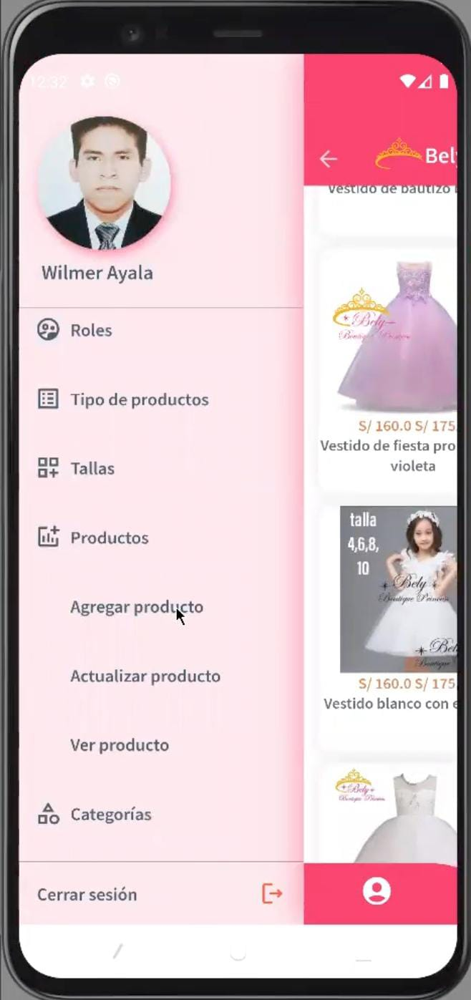
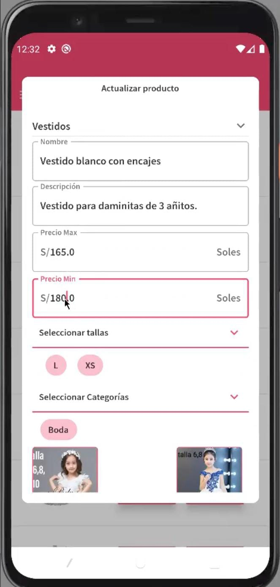
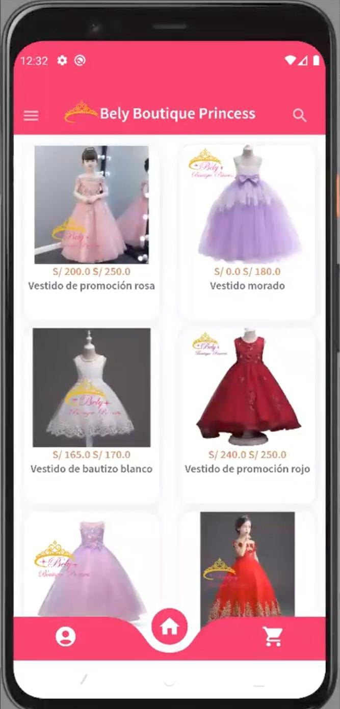

# Bely Boutique Princess

## Descripción
Sistema móvil de venta de disfraces, prendas de vestir y textiles mediante una app Android desarrollada en Flutter.

## Tecnologías

- **Framework:** Flutter (Dart)  
- **Base de datos en la nube:** Supabase (Database + Server Functions)  
- **Base de datos local:** SQLite (almacenamiento offline)  
- **Gestión de estado:** BLoC / flutter_bloc  
- **Autenticación y almacenamiento:** Firebase Auth, Cloud Firestore, Firebase Storage  
- **Otras librerías destacadas:**  
  - shared_preferences  
  - curved_navigation_bar  
  - carousel_slider  
  - flutter_map  
  - fluttertoast  
  - image_picker  
  - uuid  
  - animations  
  - data_table_2  

## Funcionalidades principales

- 🛍️ **Catálogo de productos** con imágenes y descripciones.  
- 🛒 **Carrito de compras** y **gestión de stock** en tiempo real.  
- 🔄 **Modo offline**: cache local en SQLite para productos y ventas.  
- ⚙️ **Funciones en la nube**: lógica de negocio en Supabase Server Functions.  
- 📱 **UI responsiva**: adaptada a distintos tamaños de pantalla.  
- 🔒 **Autenticación y almacenamiento** con Firebase.  
- 📊 **Mapa interactivo**: muestra ubicaciones de tiendas o puntos de venta.  

## Capturas de pantalla
<table>
  <tr>
    <td>
      
    </td>
    <td>
      
    </td>
  </tr>
  <tr>
    <td>
      
    </td>
    <td>
      
    </td>
  </tr>
</table>
## Instalación y uso

1. Clona el repositorio...
2. Ejecuta `flutter pub get`...
3. etc.

## Autor

Wilmer Jean Pierre Ayala García  
[LinkedIn](https://linkedin.com/in/wilmer-ayala-garcia) | [GitHub](https://github.com/wiljean2001)
